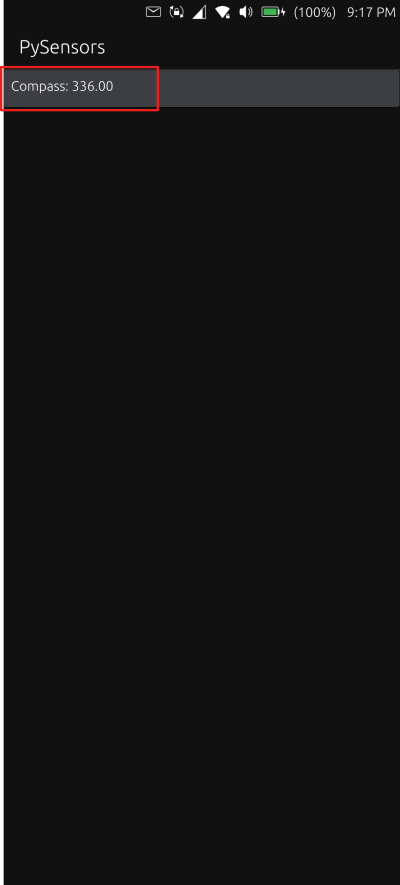

# PySensors

This is a sample Ubuntu Touch App. This show how to write Ubuntu Touch/Liomiri Apps using Python. 

This is a very basic example showing getting Compass data from you smartphone running Ubutu Touch (20.04). Current version only shows on how to extract compass data.

This has been tested on Xiaomi Redmi Pro 9 (EEA) as shown below.

## License

Copyright (C) 2024  Faisal Shahzad

This program is free software: you can redistribute it and/or modify it under
the terms of the GNU General Public License version 3, as published by the
Free Software Foundation.

This program is distributed in the hope that it will be useful, but WITHOUT ANY
WARRANTY; without even the implied warranties of MERCHANTABILITY, SATISFACTORY
QUALITY, or FITNESS FOR A PARTICULAR PURPOSE.  See the GNU General Public License
for more details.

You should have received a copy of the GNU General Public License along with
this program. If not, see <http://www.gnu.org/licenses/>.
